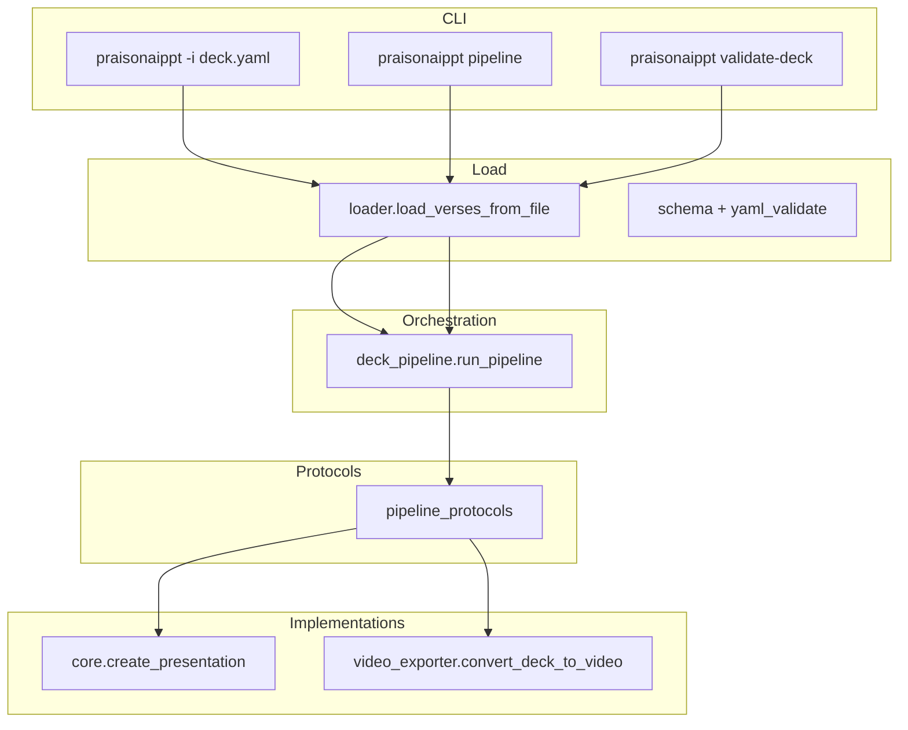

# Pipeline architecture

PraisonAI PPT separates **orchestration** (QA gates, sync, reports) from **implementations** (PPTX build, MP4 compositor). Deck config is **YAML or JSON** with the same schema.

## Layers



| Module | Role |
|--------|------|
| `loader.py` | `load_deck_mapping` (parse only), `load_verses_from_file` (templates + validate), `write_deck_mapping` (JSON or YAML write) |
| `yaml_validate.py` | `validate_pipeline`, `validate_avatar_calibration`, `validate_video_export`, … |
| `video_protocol.py` | Overlay precedence; **transition** parse/resolve/validate/timeline |
| `deck_pipeline.py` | Gates, `PipelineOptions`, `report.json`; optional `build_fn` / `export_fn` hooks |
| `pipeline_protocols.py` | Default adapters to `create_presentation` and `convert_deck_to_video` |
| `video_presets.py` | Shared `VIDEO_PRESETS` for compositor and post-render QC |
| `core.py` | PPTX generation only |
| `video_exporter.py` | Manifest + FFmpeg compositor only |

**Dependency rule:** `core` and `video_exporter` do not import `deck_pipeline`.

## Entry paths

| Path | Builds PPTX | Builds MP4 | Full gates |
|------|-------------|------------|------------|
| `praisonaippt -i deck.yaml` | Yes | If `--convert-video` | Preflight only (`--validate-deck`, `--validate-pip`, sync, seed timing) |
| `praisonaippt pipeline -i deck.yaml` | Yes (unless `--skip-build`) | If `--convert-video` | All configured gates + `report.json` |
| `praisonaippt validate-deck -i deck.yaml` | No | No | Same gates as pipeline, validate-only |

## `pipeline:` block (YAML or JSON)

See [Deck reference](yaml-reference.md#pipeline-qa-orchestration). CLI flags override YAML where both are set.

Example (`examples/heygen-50590-content.yaml`):

```yaml
pipeline:
  content_master: heygen-50590-content.yaml
  transcript_path: examples/short-script-50590_timestamps.json
  auto_sync: true
  validate_pip: true
  variant_prefix: heygen-50590
  content_approved: true
  rights_acknowledged: true
```

JSON decks use the same keys (see [Commands — JSON decks](commands.md#json-and-yaml-decks)).

## CI report

`praisonaippt pipeline` writes `report.json` (default: `.praisonaippt/{deck-stem}.pipeline-report.json`):

- `ok`, `exit_code` (0 / 1)
- `gates` — `plan_approval`, `rights_licensing`, `pip_centring`, `hero_text`, **`slide_transitions`**, `av_sync`, `slide_jpegs`, `slide_qa`, `mp4_frames`, `post_render`, …
- `steps` — per-step detail

## HeyGen variant sync

`sync-variants` copies slide content from a **content master** into `heygen-50590-*.yaml` variant files. Masters may be `.yaml` or `.json`; variant outputs remain `.yaml` by convention.

```bash
praisonaippt sync-variants -i examples/heygen-50590-content.yaml
python examples/sync_heygen_variants.py   # same operation
```

## Related

- [Commands](commands.md) — full CLI list
- [Video + transcript workflow](workflow-video-transcript-to-deck.md) — HeyGen 50590 end-to-end
- [Deck reference](yaml-reference.md) — schema and `pipeline` keys
- [Slide transitions](slide-transitions.md) — YAML matrix, showcase deck, FFmpeg paths
- [Pipeline overview](pipeline-overview.md) — deck vs daily single pipelines
- [Daily single video](daily-single-video.md) — create-news walkthrough pipeline
- [Video QA](video-qa.md) — modular `validate-qa` stages
