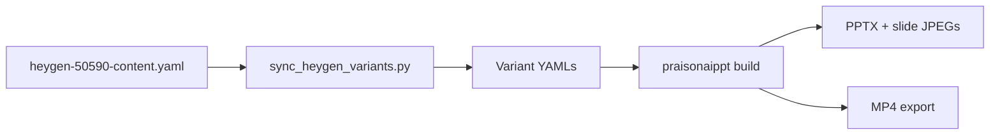

# HeyGen article examples (50590)

End-to-end workflow for a HeyGen talking-head video, Whisper transcript timing, slide deck layouts, PiP calibration, and five **media variant** MP4 exports.

**Overview of all new video/PiP features:** [Recent features](recent-features.md).

Repository paths are under `examples/` in the [PraisonAIPPT](https://github.com/MervinPraison/PraisonAIPPT) repo.

## Workflow overview



| Step | Action |
|------|--------|
| 1 | Edit **`examples/heygen-50590-content.yaml`** — slide copy, `slide_type`, `duration_sec`, `notes`, `avatar_video_path` |
| 2 | Run **`python examples/sync_heygen_variants.py`** — copies content into five variant YAMLs with correct `narration_mode` / `audio_path` |
| 3 | Build PPTX and/or MP4 per variant (below) |

Presenter narration for captions lives in each verse **`notes`** field. Slide headlines and deck layouts follow the Claude Managed Agents article (May 2026).

## Shared assets (~57 s)

| File | Role |
|------|------|
| `examples/heygen-article-50590.mp4` | HeyGen headshot + embedded AAC voice |
| `examples/short-script-50590.mp3` | Separate narration MP3 (Whisper / trim source) |
| `examples/short-script-50590_timestamps.json` | Whisper transcript + segment timing |
| `examples/short-script-50590_timestamps.txt` | Word-level timestamps (reference) |
| `examples/heygen-article-50590-words.srt` | Karaoke-style word captions |

## Narration source (pick one)

1. **Default — HeyGen video audio** — `narration_mode: avatar` or `audio_source: heygen_video`. Lip-sync / TTS from the MP4 track.
2. **Optional — video + separate MP3** — `narration_mode: audio_file` or `audio_source: external`. PiP video is visual-only for audio; MP3 drives timing and voice.
3. **TTS** — `narration_mode: tts`. Synthesise from verse `notes`; avatar video is muted for narration.

With **`narration_mode: auto`**, HeyGen embedded audio wins when the avatar file has a track, even if `audio_path` is also set on the verse. See [Video export — narration modes](video-export.md#narration-modes).

## Variant matrix

| YAML | Video (HeyGen PiP) | Audio source | `narration_mode` | Typical output |
|------|-------------------|--------------|------------------|----------------|
| `heygen-50590-video-audio-heygen.yaml` | Yes | HeyGen MP4 | `avatar` | **Default** talking-head export |
| `heygen-50590-video-visual-mp3.yaml` | Yes (muted for audio) | MP3 | `audio_file` | Studio / re-recorded voiceover |
| `heygen-50590-audio-only.yaml` | No | MP3 | `audio_file` | Slides + voiceover only |
| `heygen-50590-video-only-silent.yaml` | Yes | None | `fixed` | B-roll / timing preview |
| `heygen-50590-slides-silent.yaml` | No | None | `fixed` | Slide timing demo |

## Build one variant

```bash
VARIANT=heygen-50590-video-audio-heygen

python -m praisonaippt.cli \
  -i examples/${VARIANT}.yaml \
  -o examples/${VARIANT}.pptx \
  --convert-video \
  --video-output examples/${VARIANT}.mp4 \
  --no-list-slides
```

`video_export.narration_mode` in each variant YAML is applied automatically; no extra CLI flag is required.

## Build all showcase outputs

```bash
python examples/sync_heygen_variants.py
python examples/build_showcase_examples.py
```

Rebuilds avatar gallery, deck gallery, and all five HeyGen variant PPTX + MP4 files.

## Generate variant YAMLs from Whisper JSON

```bash
python -m praisonaippt.cli transcript-to-yaml \
  -i examples/short-script-50590_timestamps.json \
  -o examples/heygen-article-50590 \
  --variants all
```

Writes combination decks (same presets as `MEDIA_VARIANTS` in code). For the maintained article deck, prefer **content + sync** above.

## Related configuration

| Topic | Doc |
|-------|-----|
| PiP face centre / `crop_x` | [Avatar PiP calibration](avatar-calibration.md) |
| `avatar_quote` (video-only PiP, no double avatar) | [Avatar layouts](avatar-layouts.md) |
| Slide JPEG previews | [Slide JPEG export](slide-images.md) |
| `video_export` keys | [YAML deck reference](yaml-reference.md) |
| CLI flags | [Commands — video & avatar](commands.md#video-avatar-and-heygen-commands) |

## Legacy filenames

| File | Equivalent variant |
|------|-------------------|
| `heygen-article-50590-short.yaml` | `video-audio-heygen` (hand-tuned headlines) |
| `heygen-article-50590-short-audio-only.yaml` | `audio-only` |

## Source of truth in repo

The canonical copy for editors is `examples/heygen-50590-examples.md` (mirrors this page). After editing content, run `sync_heygen_variants.py` before building variants.
