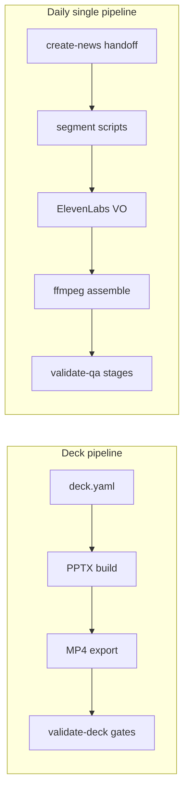

# Pipeline overview

PraisonAI PPT supports **two main video pipelines**. Both separate **build steps** from **QA gates**, but they target different project layouts.

## Which pipeline?

| Pipeline | Use when | Project layout | Entry CLI |
|----------|----------|----------------|-----------|
| **Deck pipeline** | HeyGen article decks, YAML/JSON verses, PPTX → MP4 | `examples/heygen-*.yaml` | `praisonaippt pipeline` |
| **Daily single pipeline** | YouTube walkthrough from create-news handoff, ffmpeg beats | `examples/videos/<slug>/` | `daily-single` |



## Documentation map

| Guide | Contents |
|-------|----------|
| [Pipeline architecture](architecture-pipeline.md) | Deck YAML orchestration, `pipeline:` block, `report.json` |
| [Daily single video pipeline](daily-single-video.md) | Build commands, script contract, hook montage, validation |
| [Video QA (modular stages)](video-qa.md) | `validate-qa` stages s00–s10, reports in `merge/qa/` |
| [Daily single testing](daily-single-testing.md) | All test types: unit, stage QA, legacy gates, idempotency |
| [Video + transcript workflow](workflow-video-transcript-to-deck.md) | HeyGen 50590 end-to-end |
| [Slide QA](slide-qa.md) | Golden JPEG MD5, MP4 frame checks (deck pipeline) |

## Daily single — quick path

Recommended order with **QA gates between phases** (full detail in [Daily single video](daily-single-video.md#qa-gated-pipeline-recommended)):

```bash
PROJECT=examples/videos/anthropic-claude-fable-5-mythos-5

daily-single -p $PROJECT write-scripts          # if needed
daily-single -p $PROJECT validate-qa --when pre_build
daily-single -p $PROJECT sync-assets
daily-single -p $PROJECT synthesise-vo
daily-single -p $PROJECT validate-qa --when post_vo
daily-single -p $PROJECT bookend-media
daily-single -p $PROJECT validate-qa --when pre_assemble
daily-single -p $PROJECT assemble-beats
daily-single -p $PROJECT build-captions
daily-single -p $PROJECT validate-qa --when post_build
daily-single -p $PROJECT validate-all
```

**Pilot reference:** `examples/videos/anthropic-claude-fable-5-mythos-5/`  
**Agent skills:** `.cursor/skills/daily-single-video/` and `.cursor/skills/daily-single-video-pipeline/`

## Deck pipeline — quick path

```bash
praisonaippt pipeline -i examples/heygen-50590-video-audio-heygen.yaml \
  --convert-video --video-output examples/heygen-50590-video-audio-heygen.mp4
```

Gates and `report.json`: [Pipeline architecture](architecture-pipeline.md#ci-report).

## Testing at a glance

| Layer | Daily single | Deck pipeline |
|-------|--------------|---------------|
| Unit tests | `pytest tests/test_daily_single_*.py tests/test_video_qa.py` | `pytest tests/test_*pipeline*` |
| Modular QA | `validate-qa --when …` | `validate-deck` / `pipeline` gates |
| Publish gate | `validate-all` + `validate-sync --runs 3` | `report.json` ok |

See [Daily single testing](daily-single-testing.md) for a plain-language breakdown of every check.
