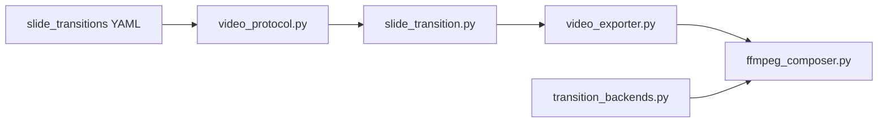

# Slide transitions

Configure how slides join in exported MP4 video. **Default is `none`** (hard cut).

Full reference deck: `examples/slide-transitions-showcase.yaml` — one edge per transition type.

---

## Quick start

```yaml
slide_transitions:
  default: crossfade
  duration_sec: 0.30
```

```bash
praisonaippt -i deck.yaml -o deck.pptx --convert-video
praisonaippt slide-transition-plan -i deck.yaml
```

---

## Transition types

| YAML `type` | Visual effect | FFmpeg path | Re-encode |
|-------------|---------------|-------------|-----------|
| `none` | Hard cut | `concat -c copy` | No |
| `segment_fade` | Dip to black in/out **each** clip | `fade=t=in/out` per segment | Per segment only |
| `crossfade` | Dissolve A → B | `xfade=transition=fade` | Yes (concat chain) |
| `wipeleft` | Wipe left | `xfade=transition=wipeleft` | Yes |
| `wiperight` | Wipe right | `xfade=transition=wiperight` | Yes |
| `slideleft` | Slide left | `xfade=transition=slideleft` | Yes |
| `slideright` | Slide right | `xfade=transition=slideright` | Yes |

!!! note "Deprecated alias"
    YAML `fade` normalises to `segment_fade` with a deprecation warning. Legacy `video_export.transition_fade_sec` maps to `{ default: segment_fade, duration_sec: N }`.

---

## Architecture



| Module | Responsibility |
|--------|----------------|
| [`video_protocol.py`](https://github.com/MervinPraison/PraisonAIPPT/blob/main/praisonaippt/video_protocol.py) | Parse, resolve precedence, clamp duration, validate, `effective_timeline_sec` |
| [`transition_backends.py`](https://github.com/MervinPraison/PraisonAIPPT/blob/main/praisonaippt/transition_backends.py) | Extensible backend registry → FFmpeg xfade names |
| [`slide_transition.py`](https://github.com/MervinPraison/PraisonAIPPT/blob/main/praisonaippt/slide_transition.py) | `maybe_apply_slide_transitions_deck`, `_slide_transitions` sidecar |
| [`video_exporter.py`](https://github.com/MervinPraison/PraisonAIPPT/blob/main/praisonaippt/video_exporter.py) | `build_compose_plan`, per-edge segment fade, SRT timing |
| [`ffmpeg_composer.py`](https://github.com/MervinPraison/PraisonAIPPT/blob/main/praisonaippt/ffmpeg_composer.py) | `build_xfade_filter_chain`, `concat_segments_with_transitions` |

---

## YAML schema

### Top-level `slide_transitions` block

```yaml
slide_transitions:
  enabled: true              # false → all edges resolve to none
  default: none              # global fallback
  duration_sec: 0.30
  min_slide_sec: 1.0         # skip transition when slide shorter
  max_fade_ratio: 0.25       # cap duration vs slide length
  edges:
    - after_slide: 2
      type: crossfade
      duration_sec: 0.4
```

`after_slide: N` = transition **leaving** slide N → entering slide N+1 (1-based, matches slide plan order).

### Nested under `video_export`

```yaml
video_export:
  transitions:
    default: none
    duration_sec: 0.30
  video_crf: 23
```

When both are set, **`slide_transitions` overrides** `video_export.transitions` for defaults.

### Per-verse

```yaml
- reference: Slide A
  text: "..."
  transition_out: crossfade
  transition_duration_sec: 0.35
```

### Edge list as top-level list (alternate shape)

```yaml
slide_transitions:
  - after_slide: 1
    type: segment_fade
    duration_sec: 0.3
```

---

## Resolution precedence

Later layers win:

1. `slide_transitions.edges[]` where `after_slide == N`
2. `verse[N].transition_out` (+ optional `transition_duration_sec`)
3. `slide_transitions.default` or `video_export.transitions.default`
4. Legacy `video_export.transition_fade_sec > 0` → `segment_fade`
5. **`none`**

Short slides: `clamp_transition_duration()` may downgrade an edge to `none` when duration exceeds `max_fade_ratio × slide_duration`.

---

## segment_fade vs crossfade

| | segment_fade | crossfade / wipes |
|---|--------------|-------------------|
| When applied | Segment render (`render_slide_segment`) | Concat (`concat_segments_with_transitions`) |
| Concat path | `-c copy` if no blend edges | Full re-encode with xfade chain |
| Audio | Per-segment AAC | `acrossfade` on blend edges |

**Mixed edges:** when the **outgoing** edge is a blend, segment fade on that slide is skipped (avoids double-softening).

---

## Showcase deck

[`examples/slide-transitions-showcase.yaml`](https://github.com/MervinPraison/PraisonAIPPT/blob/main/examples/slide-transitions-showcase.yaml) — eight verse slides, seven edges:

| After slide | Type | Notes |
|-------------|------|-------|
| 1 | `segment_fade` | Dip in/out on clip |
| 2 | `crossfade` | Dissolve |
| 3 | `wipeleft` | Overrides verse `transition_out: crossfade` |
| 4 | `wiperight` | Directional wipe |
| 5 | `slideleft` | Horizontal slide |
| 6 | `slideright` | Horizontal slide |
| 7 | `none` | Hard cut before final slide |

```bash
# Validate schema + transition gate
praisonaippt validate-deck -i examples/slide-transitions-showcase.yaml

# Print resolved matrix
praisonaippt slide-transition-plan -i examples/slide-transitions-showcase.yaml

# Preview one edge
praisonaippt slide-transition-preview -i examples/slide-transitions-showcase.yaml --slide 3

# Build PPTX + MP4 (requires ffmpeg, pdftoppm, libreoffice)
praisonaippt -i examples/slide-transitions-showcase.yaml \
  -o examples/slide-transitions-showcase.pptx --convert-video
```

Expected plan output (edge column abbreviated):

```
 After  Type            Dur(s)  Source
     1  segment_fade     0.300  edge
     2  crossfade        0.350  edge
     3  wipeleft         0.350  edge
     4  wiperight        0.350  edge
     5  slideleft        0.350  edge
     6  slideright       0.350  edge
     7  none             0.000  edge
```

---

## Continuous avatar caveat

With `avatar_timeline: continuous` and blend transitions, lip-sync may drift. For HeyGen decks prefer `per_slide` or `segment_fade` only. A warning is logged at export time.

---

## SRT captions

When any blend edge exists, `write_srt` uses `effective_timeline_sec()` (overlap subtracted). Hard-cut decks use the sum of `duration_sec` values.

---

## CLI

| Command | Purpose |
|---------|---------|
| `slide-transition-plan -i deck.yaml [--force]` | Resolved edge matrix |
| `slide-transition-preview -i deck.yaml --slide N` | Transition leaving slide N |

---

## Pipeline gate

| Gate | Step | When |
|------|------|------|
| `GATE_SLIDE_TRANSITIONS` | `slide_transitions` | `pipeline.validate_transitions: true` (default) |

```yaml
pipeline:
  validate_transitions: true
  strict_transitions: false   # fail on warnings when true
```

Set `slide_transitions.enabled: false` to skip resolution entirely.

Sidecar after build hook: `_slide_transitions` on the deck dict (resolved edges + report).

---

## Python API

```python
from praisonaippt import (
    load_verses_from_file,
    maybe_apply_slide_transitions_deck,
    resolve_edge_transitions,
    TransitionDefaults,
    format_transition_report,
    list_transition_backends,
)
from praisonaippt.video_exporter import iter_slide_plan, build_compose_plan, VideoOptions

data = load_verses_from_file("examples/slide-transitions-showcase.yaml")
plan = list(iter_slide_plan(data))
data = maybe_apply_slide_transitions_deck(data, plan, source_file="deck.yaml")
print(data["_slide_transitions"]["report"])

# Low-level resolve
entries = [{"duration_sec": 4.0, "verse": v} for v in plan]
edges = resolve_edge_transitions(entries, data.get("video_export"), data.get("slide_transitions"))
print(format_transition_report(edges, slide_count=len(entries)))
print("Backends:", list_transition_backends())
```

Register a custom backend:

```python
from praisonaippt.transition_backends import register_transition_backend

class MyBackend:
    name = "my_fade"
    requires_reencode = True
    def ffmpeg_xfade_name(self):
        return "fade"

register_transition_backend(MyBackend())
```

---

## Validation checklist

Use this to confirm a local install matches the reference implementation:

| Check | Command / test |
|-------|----------------|
| Default none (no fade filters) | Deck without transition keys → `fade_sec=0` in segments |
| Protocol resolve precedence | `pytest tests/test_video_transitions.py` |
| YAML schema | `pytest tests/test_yaml_validate.py -k slide_transitions` |
| FFmpeg filter chain | `pytest tests/test_ffmpeg_transitions.py` |
| Backend registry | `pytest tests/test_transition_backends.py` |
| Pipeline gate | `pytest tests/test_pipeline_ci_gates.py -k slide_transitions` |
| Showcase deck loads | `praisonaippt validate-deck -i examples/slide-transitions-showcase.yaml` |
| Plan matrix | `praisonaippt slide-transition-plan -i examples/slide-transitions-showcase.yaml` |

---

## Related

- [Video export](video-export.md) — compositor, narration, presets
- [Deck reference (YAML)](yaml-reference.md) — `slide_transitions`, `video_export.transitions`
- [Commands](commands.md) — CLI reference
- [Pipeline architecture](architecture-pipeline.md) — gates and hooks
- [Slide QA](slide-qa.md) — `GATE_SLIDE_TRANSITIONS` in `report.json`
- [Examples](examples.md) — showcase build commands
