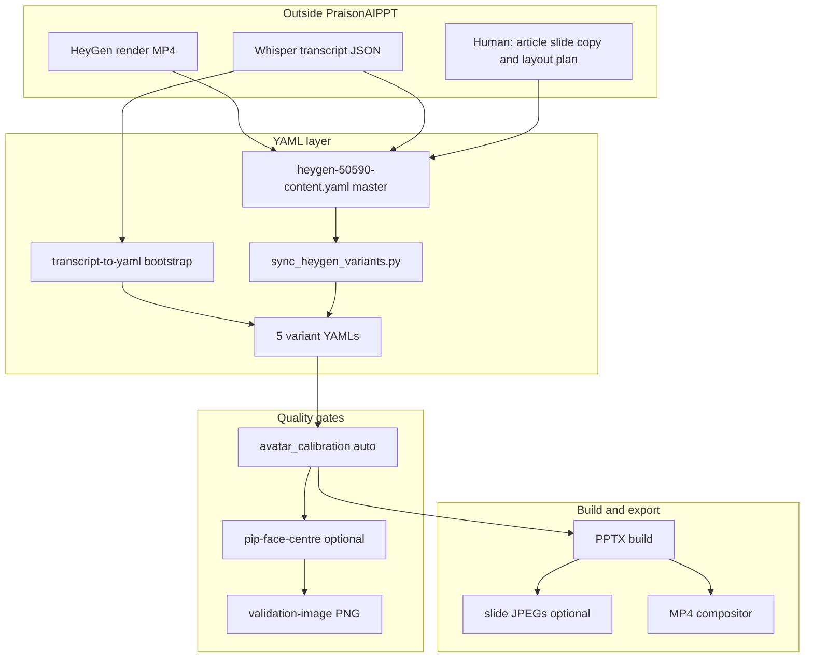

# Workflow: video + transcript → deck YAML → PPTX → MP4

End-to-end map of how PraisonAIPPT turns a **HeyGen (or other) talking-head video** and a **Whisper transcript** into a polished deck with correct timing, layouts, PiP framing, and export.

**Related:** [HeyGen examples](heygen-examples.md) · [Recent features](recent-features.md) · [Avatar calibration](avatar-calibration.md) · [Video export](video-export.md) · [YAML reference](yaml-reference.md)

---

## What you start with

| Asset | Typical path | Role |
|-------|--------------|------|
| HeyGen MP4 | `examples/heygen-article-50590.mp4` | Visual + embedded voice (~57 s) |
| Optional MP3 | `examples/short-script-50590.mp3` | Separate narration / alignment source |
| Whisper JSON | `examples/short-script-50590_timestamps.json` | Segments, words, timings |
| Optional word SRT | `examples/heygen-article-50590-words.srt` | Karaoke captions |

Steps **outside** this repo today: record in HeyGen, run Whisper, write article copy for rich slides.

---

## Pipeline overview



---

## All steps (ordered)

### Phase 0 — Acquire media (manual / external tools)

| # | Step | Output | Automate? |
|---|------|--------|-----------|
| 0.1 | Script and record in HeyGen | `heygen-article-50590.mp4` | HeyGen API (not in repo) |
| 0.2 | Export or extract narration MP3 if needed | `short-script-50590.mp3` | ffmpeg / HeyGen |
| 0.3 | Transcribe with Whisper (word timestamps) | `*_timestamps.json` | Whisper CLI / API |
| 0.4 | Optional word-level SRT for karaoke | `*-words.srt` | `transcript-to-yaml --align karaoke` |

---

### Phase 1 — Bootstrap deck YAML from transcript (automated CLI)

**Purpose:** First-pass YAML with segment timing, `notes`, simple `slide_type`, and `audio_start_sec` — not the full article deck.

```bash
praisonaippt transcript-to-yaml \
  -i examples/short-script-50590_timestamps.json \
  -o examples/heygen-article-50590 \
  --transcript-mode thematic \
  --transcript-audio examples/short-script-50590.mp3 \
  --align silence,karaoke \
  --variants all
```

| # | What happens | Code / output |
|---|--------------|---------------|
| 1.1 | Load Whisper JSON | `transcript_loader.load_whisper_json` |
| 1.2 | Group segments → verses | `segments_to_verses` (`thematic` or `full`) |
| 1.3 | Set `duration_sec`, `audio_start_sec`, `notes` | Wall-clock merge per slide |
| 1.4 | Attach `avatar_video_path` / `audio_path` | `build_deck_yaml` / `MEDIA_VARIANTS` |
| 1.5 | Write variant YAMLs | `heygen-50590-video-audio-heygen.yaml`, … |
| 1.6 | Optional short/full decks | `heygen-article-50590-short.yaml` |

**Layout at this stage:** `avatar_headline`, `avatar_quote`, etc. from `THEMATIC_LAYOUTS` — not `deck_*` / `big_number` article layouts.

| Automate? | Notes |
|-----------|--------|
| Yes | Fully via CLI |
| Gap | Does not replace hand-crafted **content** YAML for production article decks |

---

### Phase 2 — Content and layout plan (manual + assisted)

**Purpose:** Rich slides, deck layouts, bullets, tables, quotes — the “good PPT” layer.

| # | Step | Where it lives | Automate? |
|---|------|----------------|-----------|
| 2.1 | Presentation title / subtitle | `presentation_*` in content YAML | Manual or LLM-assisted |
| 2.2 | Choose `slide_type` per beat | `sections[].verses[].slide_type` | Manual (see [Deck layouts](deck-layouts.md), [Slide layouts](slide-layouts.md)) |
| 2.3 | Slide copy (headlines, bullets, tables) | `text`, `items`, `reference`, … | Manual / copy from article |
| 2.4 | Presenter notes / captions | `notes` (synced to transcript text) | Paste from Whisper or edit |
| 2.5 | Per-slide timing | `duration_sec`, `audio_start_sec` | Tune against transcript (can start from Phase 1) |
| 2.6 | Media paths | `avatar_video_path`, optional `audio_path` | Paths in YAML |
| 2.7 | PiP / slide style | `slide_style`, `layouts.pip` | Defaults + overrides |
| 2.8 | Calibration intent | `avatar_calibration` block | YAML |
| 2.9 | Video export defaults | `video_export`, `slide_timestamps` | YAML |

**Source of truth (50590 article):** `examples/heygen-50590-content.yaml`

| Automate? | Notes |
|-----------|--------|
| Partial | Timing/notes can be seeded from Phase 1; layout/copy still editorial |
| Future | LLM agent: transcript + outline → draft `verses[]` with `slide_type` |

---

### Phase 3 — Propagate to media variants (automated script)

| # | Step | Command | Output |
|---|------|---------|--------|
| 3.1 | Copy content → 5 variants | `python examples/sync_heygen_variants.py` | `heygen-50590-*.yaml` |

Each variant gets correct `video_export.narration_mode`, `audio_source`, and per-verse `audio_path` / `avatar_video_path` flags.

| Automate? | Notes |
|-----------|--------|
| Yes | Run after every content edit |
| Warning | Do not edit variant YAMLs directly — they are overwritten on sync |

---

### Phase 4 — Head centre and PiP framing (automated on build)

| # | Step | When | What gets written |
|---|------|------|-------------------|
| 4.1 | Hybrid calibration | Every `praisonaippt -i deck.yaml` build if `avatar_calibration.auto: true` | `crop_x_ratio`, `crop_y_ratio` → `slide_style.layouts.pip` (cache + merge) |
| 4.2 | Explicit recalibrate | `calibrate-avatar --force` | Cache under `.praisonaippt/avatar-framing/` |
| 4.3 | Persist into YAML | `calibrate-avatar --write` | `layouts.pip.crop_x_ratio` in deck YAML |
| 4.4 | Measure / validate | `pip-face-centre --validation-image` | Console metrics + annotated PNG (L/R/T/B) |
| 4.5 | Hero text auto placement | `hero_text_placement.auto: true` + `text_panel.anchor: auto` | `_hero_panel_anchor` per hero slide (cache + merge) |
| 4.6 | Hero measure / validate | `hero-panel-centre --validation-image` | Panel L/R/T/B gaps to nearest UI text |
| 4.7 | Multi-phase helper | `python examples/avatar_calibration_agents.py deck.yaml` | Sample seeks → tune → optional SDK review |

| # | Per avatar `slide_type` headspace | Config |
|---|----------------------------------|--------|
| 4.8 | Default `crop_y` / `zoom` per layout | `layout_tokens.py` → `layouts.<slide_type>` |
| 4.9 | Extra trim for circle PiP | `avatar_framing()` circle mask |

| Automate? | Notes |
|-----------|--------|
| Yes | Default path needs no manual `crop_x` if cache is warm |
| Optional | Human reviews validation PNG; adjust `crop_x_preferred` or `--write` |

---

### Phase 5 — Build PPTX (automated)

```bash
VARIANT=heygen-50590-video-audio-heygen

praisonaippt -i examples/${VARIANT}.yaml \
  -o examples/${VARIANT}.pptx \
  --no-list-slides
```

Internal order:

1. Load and validate YAML  
2. `maybe_auto_calibrate_deck`  
3. `maybe_auto_place_hero_text_deck` (when `hero_text_placement.auto: true`)  
4. `create_presentation` (renderers per `slide_type`)  
4. Optional: GDrive upload, PDF, slide JPEGs  

| Automate? | Yes |

---

### Phase 6 — Slide JPEG previews (optional, automated)

| # | Step | Command |
|---|------|---------|
| 6.1 | Build + export JPEGs | `praisonaippt build-slide-images -i deck.yaml -o deck.pptx` |
| 6.2 | From PPTX only | `praisonaippt export-slide-jpegs deck.pptx` |

Requires `slide_images_dir` in YAML. See [Slide JPEG export](slide-images.md).

---

### Phase 7 — MP4 export (automated)

```bash
praisonaippt -i examples/${VARIANT}.yaml \
  -o examples/${VARIANT}.pptx \
  --convert-video \
  --video-output examples/${VARIANT}.mp4
```

| # | Step | Detail |
|---|------|--------|
| 7.1 | PPTX → PDF → PNG (LibreOffice + poppler) | Slide raster |
| 7.2 | FFmpeg overlays | Avatar PiP, media regions |
| 7.3 | Narration mux | HeyGen track, MP3, or TTS per `narration_mode` |
| 7.4 | Captions sidecar | `.srt` when enabled |

Standalone rerun: `praisonaippt convert-video deck.pptx` (needs YAML sidecar beside PPTX).

---

### Phase 8 — Batch rebuild (automated)

```bash
python examples/build_showcase_examples.py
```

Runs sync + builds avatar gallery, deck gallery, and all five HeyGen variants.

---

## Two production paths (choose one)

| | **Path A — Bootstrap** | **Path B — Article (recommended)** |
|---|------------------------|-------------------------------------|
| Start | Whisper JSON only | Whisper + editorial plan |
| YAML | `transcript-to-yaml` | Edit `heygen-50590-content.yaml` |
| Layouts | Simple avatar slides | `deck_*`, `big_number`, tables, quotes |
| Timing | Auto from segments | Hand-tuned + `slide_timestamps` |
| Best for | Quick demos, first draft | Production HeyGen article video |

**Recommended loop for Path B:**

1. Phase 1 optional — seed timings/notes from transcript  
2. Phase 2 — edit `heygen-50590-content.yaml`  
3. Phase 3 — `sync_heygen_variants.py`  
4. Phase 4–7 — build with `--convert-video`; use `pip-face-centre --validation-image` until `centred: yes`  
5. Phase 6 — review `slide_images/*.jpg`  

---

## YAML artefacts per stage

| Stage | Files produced |
|-------|----------------|
| Whisper | `short-script-50590_timestamps.json` |
| Bootstrap | `heygen-article-50590-short.yaml`, `heygen-50590-*.yaml` (variants) |
| Content master | `heygen-50590-content.yaml` |
| Sync | Five `heygen-50590-{variant}.yaml` |
| Calibration cache | `.praisonaippt/avatar-framing/*.json` (gitignored) |
| Build | `*.pptx`, `slide_images/.../slide-NNN.jpg`, optional `golden/`, `mp4-frames/` |
| Export | `*.mp4`, optional `*.srt` |
| QA | `*_pip_validation.png`, `.praisonaippt/*.pipeline-report.json` |

---

## Automation plan (what exists vs what to add)

### Already automated

| Capability | Tool |
|------------|------|
| Transcript → timed verses | `praisonaippt transcript-to-yaml` |
| Media variant YAMLs | `sync_heygen_variants.py`, `MEDIA_VARIANTS` |
| PiP crop_x / crop_y | `avatar_calibration.auto` on build |
| Face centre check + diagram | `pip-face-centre --validation-image` |
| PPTX + MP4 | `praisonaippt -i … --convert-video` |
| Slide JPEGs | `build-slide-images` |
| Full matrix build | `build_showcase_examples.py` |
| Calibration phases | `avatar_calibration_agents.py` |

### Semi-automated (human in the loop)

| Capability | Today | Suggested improvement |
|------------|-------|------------------------|
| Slide copy + layout choice | Manual edit of content YAML | Agent drafts `verses[]` from transcript + style guide |
| Timing polish | Manual `duration_sec` | Diff Whisper vs MP3; flag drift in CLI |
| Variant sync reminder | Manual run sync script | Hook sync into pre-build CLI |
| Centring QA | Visual PNG review | CI gate: `pip-face-centre` + fail if `not centred` |

### External only (not in repo)

| Item | Tool |
|------|------|
| HeyGen render | HeyGen API / studio |
| Whisper (optional) | `praisonaippt transcribe -i audio.mp3 -o timestamps.json` if `whisper` CLI installed |

---

## Unified pipeline (implemented)

```bash
VARIANT=heygen-50590-video-audio-heygen

# Full run: sync → validate → calibrate → PPTX → JPEGs → MP4 → report.json
praisonaippt pipeline -i examples/${VARIANT}.yaml \
  -o examples/${VARIANT}.pptx \
  --content-master examples/heygen-50590-content.yaml \
  --transcript-json examples/short-script-50590_timestamps.json \
  --convert-video \
  --video-output examples/${VARIANT}.mp4 \
  --export-slide-jpegs \
  --validate-pip \
  --validation-image examples/qa/pip-validation.png \
  --pipeline-report examples/.praisonaippt/${VARIANT}.pipeline-report.json
```

| Step | Command |
|------|---------|
| Transcribe (optional) | `praisonaippt transcribe -i audio.mp3 -o timestamps.json` |
| Plan draft slides | `praisonaippt plan-slides -i timestamps.json -o draft.yaml --content-master content.yaml` |
| Bootstrap YAML | `praisonaippt transcript-to-yaml -i timestamps.json -o prefix --variants all` |
| Sync variants | `praisonaippt sync-variants -i heygen-50590-content.yaml` |
| Validate only | `praisonaippt validate-deck -i deck.yaml --validate-pip` |
| Build (auto-sync + QA) | `praisonaippt -i deck.yaml -o deck.pptx` (when `pipeline.auto_sync` in YAML) |
| Seed timings | `praisonaippt -i deck.yaml --seed-timing --transcript-json timestamps.json` |

Deck YAML may include:

```yaml
pipeline:
  content_master: heygen-50590-content.yaml
  transcript_path: examples/short-script-50590_timestamps.json
  auto_sync: true
  validate_pip: true
  variant_prefix: heygen-50590
```

Build with `--convert-video` runs **post-render ffprobe** (duration, audio stream, resolution, FPS).

---

## CI gates validation matrix

Each gate is recorded in `report.json` under `gates` with `exit_code` (0 = pass, 1 = fail).

| Gate | Validated by | CLI / YAML |
|------|----------------|------------|
| **Unified pipeline** | `praisonaippt pipeline` → `report.json` `exit_code` | `pipeline` command |
| **Pre-render** | `schema` + `assets` (ffprobe on MP4/MP3 before PPTX) | `validate-deck`, `pipeline --skip-build` |
| **Post-render** | `post_render` (duration ± tol, audio, width×height, FPS) | `pipeline --convert-video` |
| **A/V sync** | `av_sync` + `timing_drift` (Whisper vs `audio_start_sec` / ffprobe media) | `transcript_path` in `pipeline:` |
| **PiP centring** | `pip_centring` (fails CI when not centred) | `validate_pip: true` or `--validate-pip`; `--strict-pip` = all seeks |
| **Slide JPEG golden** | `slide_jpegs` (MD5 vs `golden_slide_dir`) | `pipeline.golden_slide_dir` |
| **Slide QA manifest** | `slide_qa` (expect_pip/media, hero coverage) | `slide_qa` + verse `qa`; `validate_slide_qa` |
| **MP4 seek frames** | `mp4_frames` (one JPEG per verse at `audio_start_sec`) | `pipeline.export_mp4_frames`, `mp4_frames_dir` |
| **Plan approval** | `plan_approval` before sync | `plan-slides` → edit → `approve-plan` → `plan_draft` / `content_approved` |
| **Rights/licensing** | `rights_licensing` | `pipeline.rights_acknowledged` + `require_rights_ack` for CI blocker |

```bash
# CI-friendly validate (exit 1 on any failed gate)
praisonaippt validate-deck -i examples/heygen-50590-video-audio-heygen.yaml \
  --validate-pip --pipeline-report report.json
echo $?   # 0 = pass

# Plan workflow (before sync, not after MP4)
praisonaippt plan-slides -i examples/short-script-50590_timestamps.json \
  -o examples/heygen-50590-draft.yaml
praisonaippt approve-plan -i examples/heygen-50590-draft.yaml
```

---

## Minimal command cheat sheet (Path B today)

```bash
# 1. Edit examples/heygen-50590-content.yaml

# 2. One-shot pipeline (replaces manual sync + validate + build)
praisonaippt pipeline -i examples/heygen-50590-video-audio-heygen.yaml \
  -o examples/heygen-50590-video-audio-heygen.pptx \
  --convert-video --video-output examples/heygen-50590-video-audio-heygen.mp4 \
  --validate-pip --export-slide-jpegs
```

---

## Checklist before calling a deck “done”

- [ ] Whisper timings match wall-clock video (no large drift on last slide)  
- [ ] `notes` readable and aligned with narration  
- [ ] `slide_type` appropriate per beat (deck vs avatar vs list)  
- [ ] `sync_heygen_variants.py` run after content edits  
- [ ] `pip-face-centre` shows `centred: yes` or L≈R on validation PNG  
- [ ] Listened to MP4 — correct audio source variant (HeyGen vs MP3)  
- [ ] Slide JPEGs look correct (quote slide may omit baked avatar — check MP4 or `mp4-frames/`)  
- [ ] `validate-deck` passes (`slide_jpegs`, `slide_qa`, `mp4_frames` when configured)  
- [ ] Full-bleed hero slides: headline panel clears PiP and key UI text  

---

## See also

- [Commands — video & avatar](commands.md#video-avatar-and-heygen-commands)  
- [Examples/heygen-50590-examples.md](https://github.com/MervinPraison/PraisonAIPPT/blob/main/examples/heygen-50590-examples.md) (repo copy)  
- `examples/avatar_calibration_agents.py` — three-phase calibration helper  
